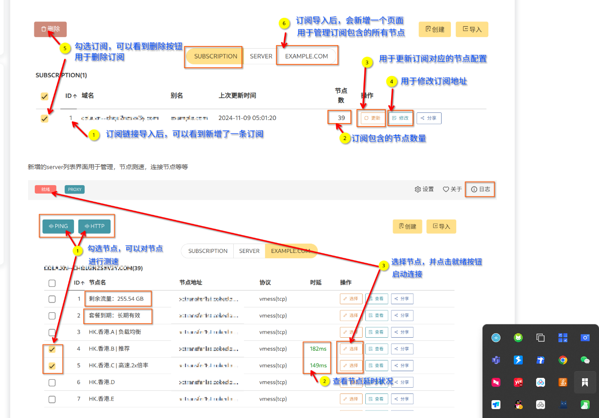

#### 服务器翻墙方法

自己拉一个Linux的梯子就行

我用的v2rayA 主要是对于没有GUI的服务器来说，他的使用提供了webui  很方便

#### v2rayA的安装

###### 官方文档

https://v2raya.org/docs/prologue/quick-start/

###### 安装说明

抄官方文档即可 我是再openCloudOS 6.x上面那啥的  用的这个

https://v2raya.org/docs/prologue/installation/redhat/

###### FAQ

```
[ssss]# sudo dnf copr enable zhullyb/v2rayA
Enabling a Copr repository. Please note that this repository is not part
of the main distribution, and quality may vary.

The Fedora Project does not exercise any power over the contents of
this repository beyond the rules outlined in the Copr FAQ at
<https://docs.pagure.org/copr.copr/user_documentation.html#what-i-can-build-in-copr>,
and packages are not held to any quality or security level.

Please do not file bug reports about these packages in Fedora
Bugzilla. In case of problems, contact the owner of this repository.

Do you really want to enable copr.fedorainfracloud.org/zhullyb/v2rayA? [y/N]: y
Error: It wasn't possible to enable this project.
Repository 'epel-9-x86_64' does not exist in project 'zhullyb/v2rayA'.
Available repositories: 'centos-stream-9-aarch64', 'fedora-39-x86_64', 'fedora-40-x86_64', 'fedora-40-aarch64', 'fedora-41-x86_64', 'fedora-39-aarch64', 'fedora-41-aarch64', 'centos-stream-9-x86_64'

If you want to enable a non-default repository, use the following command:
  'dnf copr enable zhullyb/v2rayA <repository>'
But note that the installed repo file will likely need a manual modification.

```

如图是因为使用  `sudo dnf copr enable zhullyb/v2rayA `的时候，没有指定版本，默认是`fedora-41-x86_64`，但是openCloudOS 6.x 没有这个版本，所以会报错。 使用 `sudo dnf copr enable zhullyb/v2rayA centos-stream-9-x86_64`指定版本即可。

#### v2rayA的使用和配置

如上安装好之后， 

systemctl status  v2raya.service检查状态 

云服务器控制台检查安全组放行2017端口

浏览器输入 `<公网IP>：2017` 进入UI界面


需要自己注册，之后自己找一个梯子的订阅链接导入进去，导入之后，在UI的这个位置



就OK了
